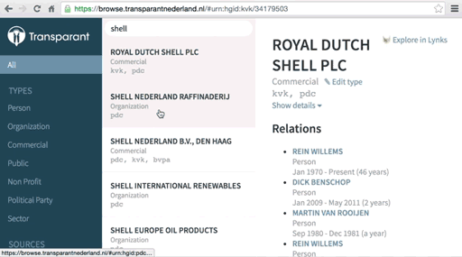

# Transparant Nederland Relationizer [](https://travis-ci.org/transparantnederland/browser) [](https://zenhub.io)

A browser for [Transparant Nederland](https://transparantnederland.nl/) data. Option to flag wrong or incomplete data.



## Install

```shell
npm install
```

## Develop

```shell
npm start
```

This will run a development server on [http://localhost:3000](http://localhost:3000).

```shell
npm run lint
```
It is recommended that you add an [ESLint](http://eslint.org/) plugin to your preferred code editor, but you can also use this command.

```shell
npm test
npm run test:watch
```
Run a handful of unit tests.

## Flags API

```
GET /api/flags/pits.ndjson
GET /api/flags/relations.ndjson
DELETE /api/flags
```

Example workflow to backup to corrections dataset:

1. Back up relation flags
```
curl -u tim 'https://browse.transparantnederland.nl/api/flags/relations.ndjson' >> /var/tnl/transparantnederland-data/_z_corrections/relations.ndjson
```
2. Back up pit flags
```
curl -u tim 'https://browse.transparantnederland.nl/api/flags/pits.ndjson' >> /var/tnl/transparantnederland-data/_z_corrections/pits.ndjson
```
3. Delete all flags
```
curl -u <user> -XDELETE 'https://browse.transparantnederland.nl/api/flags'
```

Copyright (C) 2016 [Waag Society](http://waag.org).
